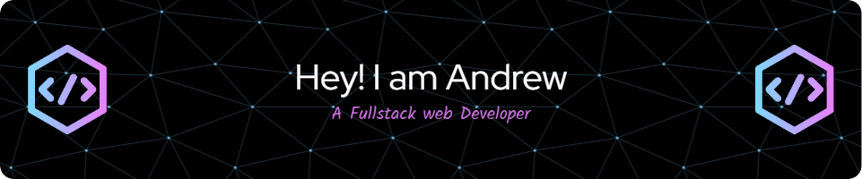

## About Me

I'm a 4th year student pursuing Multimedia career in Barcelona, Spain. I have passion for software and web development as well as game development. I'm currently into Web Development as Backend developer and working on several Crusader Kings 3(CK3) modding projects.

 
 

🌱 I’m currently learning React, mobile development with Flutter and generative art with Processing.

 
 

💬 You can ask me anything about backend web development. Just contact me through my Instagram account

## Technology Stack
  

    
    
    
    
    
    
    
    
    
    
    
    
    
    
    
    
    
    
    

  

## My Github Stats

  
  

  

## Connect with me

## My projects
- [Web project](https://www.influencetarget.com) as **Backend Developer**.
- [Mod project](https://steamcommunity.com/sharedfiles/filedetails/?id=3288510635) as **Event Scripter** (WIP).
- [Game Jam Project (1 Week game)](https://github.com/Andresas106/LoopedGameJam) as Unity Programmer.
- [Game Project](https://github.com/Andresas106/PBL6_BacoStudios/releases/tag/v0.1.0) as Unity Programmer.

